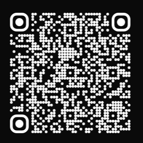

# TMDB Nuxt3 App

A movie discovery web application built with Nuxt3 and the TMDB API.  
This project was developed during my internship and is deployed live on Vercel.

---

## Live Demo
[tmdb-nuxt3.vercel.app](https://tmdb-nuxt3-okb866d1n-eluwias-projects.vercel.app/)

Scan the QR code below to open directly on your mobile device:  
(Add your QR code image once uploaded)



---

## Tech Stack

- Nuxt3 (Vue 3, Composition API) – app framework  
- JavaScript (ES6+) – logic and components  
- TMDB API – movie & TV data source  
- Tailwind CSS – responsive UI and styling  
- Docker – containerization during development/deployment  
- Vercel – hosting and continuous deployment  

---

## Features

- Search and browse movies and TV shows from TMDB  
- Dynamic routing for individual movie and TV details  
- Responsive design optimized for both desktop and mobile  
- Deployed as a production-ready app with CI/CD on Vercel  

---

## Setup

```bash
# Clone the repo
git clone https://github.com/eluwia/tmdb-nuxt3-app.git
cd tmdb-nuxt3-app

# Install dependencies
npm install

# Run locally
npm run dev
